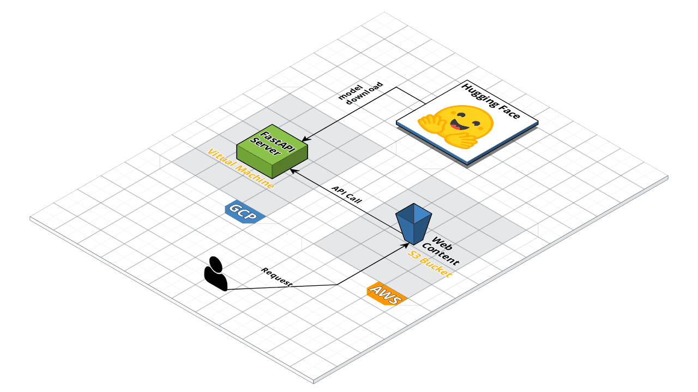

# Model Serving

저희가 작성한 모델을 시연한 사이트는 하단 URL에서 직접 확인하실 수 있습니다.

상세한 구현 코드는 [api](./api/) 폴더와 [web](./web/) 폴더를 확인해 주세요.

## 시연 사이트

http://math-challenge.wetov.io

## 시연 화면

## 구성도

API 서버는 아이펠로부터 제공받은 GCP 가상머신을 사용하였으며, 웹 컨텐츠의 경우는 비용이 저렴하고 작업자가 익숙한 [AWS S3](https://aws.amazon.com/s3/)를 사용했습니다. 기호에 따라서 하나의 서버에서 api와 web 컨텐츠를 모두 구현할 수도 있습니다.

## 추후 진행해 볼 만한 것

- [ ] 허깅페이스가 아닌 서버에서 직접 모델 저장 및 관리
- [ ] [bentoml](https://github.com/bentoml/BentoML)과 같은 모델 서빙 프레임워크 활용

## 참고

- [Deploying Transformer Models](https://chatbotslife.com/deploying-transformer-models-1350876016f)